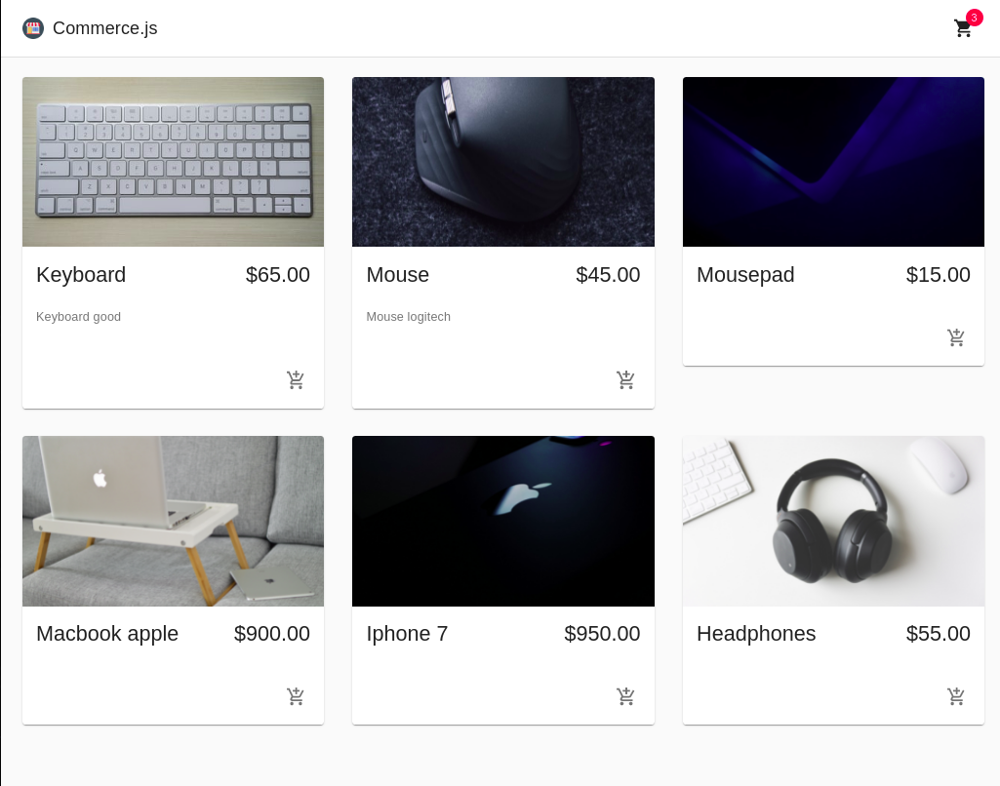

<h2>Ecommerce React</h2>

<h2>Apresentação da aplicação<h2>



<h2>Descrição do projeto</h2>

<p>Esse projeto tem como objetivo treinar desenvolvimento de ecommerce. Essa aplicação foi desenvolvida seguindo um tutorial
americano em react, foi usada a api do <a href="https://commercejs.com/" target="_blank" >commerce js</a> para lançamentos de produtos e a api
do <a href="https://stripe.com/en-br" target="_blank" >Stripe</a> para pagamentos. O link do tutorial está nesse <a href="https://www.youtube.com/watch?v=377AQ0y6LPA">Link</a>
</p>


## :rocket: Tecnologias

- [React](https://pt-br.reactjs.org/)
- [Javascript](https://www.javascript.com/)

<div id="requisitos">

## :white_check_mark: Requisitos

<p>Antes de executar :checkered_flag:, você precisar ter o <a href="https://git-scm.com" target="_blank" >GIT</a>
e o <a href="https://nodejs.org/pt-br/" target="_blank" >Node</a> instalados.</p>

</div>

```bash

# Clone este projeto
$ git clone https://github.com/guisantanaa/ecommerce-react

# Entre na pasta ecommerce-react
$ cd ecommerce-react
$ Execute o comando 'code .' e o projeto sera aberto no Visual Studio Code

# Instale as dependências
$ yarn

# Inicialize
$ yarn start

# O servidor irá iniciar em http://localhost:3000

Lembrando que precisa usar a api do commerce js e a do stripe. Portanto caso queira utilizar a aplicação 
corretamente crie um arquivo .env na raiz do projeto adicione essas duas linhas de código e coloque a api ao lado desses arquivos.
REACT_APP_CHEC_PUBLIC_KEY=
REACT_APP_STRIPE_PUBLIC_KEY=

```
